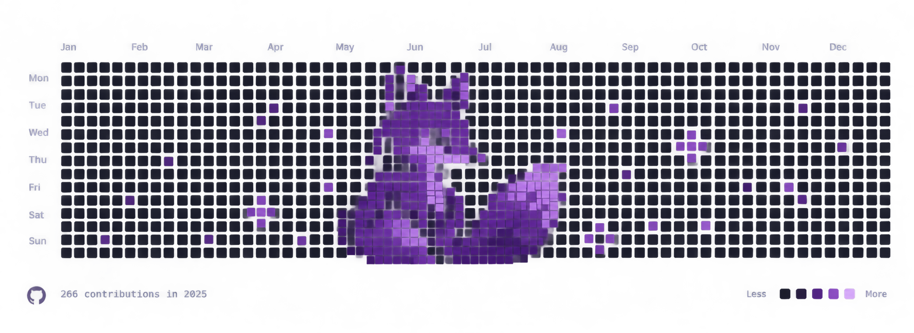

 

<h3>Hi, I'm Lạc Đông</h3>

<b>Software Engineer · Business Analyst</b>

  
  
  

 

  

 

I'm a final-year **Software Engineering student at FPT University**, interested in the intersection of **software engineering, product thinking, business analysis, and intelligent technologies**.

I enjoy turning ambiguous problems into structured systems — from understanding user requirements and designing workflows to building and improving software solutions.

<h4>Currently Exploring</h4>

- Software Architecture & Backend Systems
- Business Analysis & Product Development
- Artificial Intelligence & Machine Learning
- FinTech & Quantitative Technologies
- UI / UX and System Design

> I don't just want to write code.  
> I want to understand **why the system should exist, how it should work, and how to make it better.**

 

  

 

<h4>Languages & Frameworks</h4>

<table>
<tr>

<td align="center" width="70">
  
</td>

<td align="center" width="70">
  
</td>

<td align="center" width="70">
  
</td>

<td align="center" width="70">
  
</td>

<td align="center" width="70">
  
</td>

</tr>
</table>

<h4>Data & Infrastructure</h4>

<table>
<tr>

<td align="center" width="70">
  
</td>

<td align="center" width="70">
  
</td>

<td align="center" width="70">
  
</td>

<td align="center" width="70">
  
</td>

<td align="center" width="70">
  
</td>

<td align="center" width="70">
  
</td>

<td align="center" width="70">
  
</td>

</tr>
</table>

<h4>Tools & Design</h4>

<table>
<tr>

<td align="center" width="70">
  
</td>

<td align="center" width="70">
  
</td>

<td align="center" width="70">
  
</td>

</tr>
</table>

 

  

 

<table>
<tr>

<td width="33%" align="center">

</td>

<td width="33%" align="center">

</td>

<td width="33%" align="center">

</td>

</tr>
</table>

 

  

 

 

  

### Think deeply. Build quietly. Improve continuously.

 

*"The goal isn't to know everything — it's to understand enough to build something meaningful."*

 

&nbsp;

